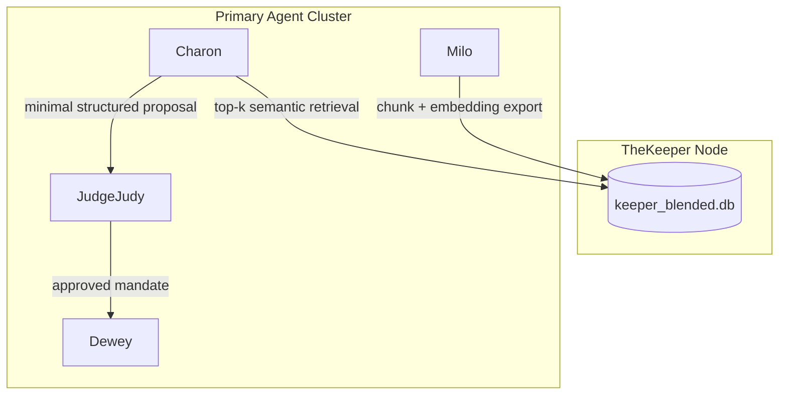

# 🗝️ TheKeeper: Semantic World-State Aggregator

TheKeeper is the read-focused semantic memory layer for Charon. It stores blended, retrieval-ready chunks so Charon can perform local search first and send only minimal context to the LLM.

## Core Responsibilities

- Aggregate chunked guide context from Milo.
- Persist retrieval text and embeddings in a local SQLite file (`keeper_blended.db`).
- Serve as Charon's local read path for semantic lookups.
- Keep mutation authority outside the keeper path (writes still flow through governance and execution services).

## Internal Architecture



## Quickstart (For New Downloaders)

From the TheKeeper folder:

```bash
python scripts/bootstrap_keeper.py --seed-demo
```

What this does:

1. Initializes keeper tables if they do not exist.
2. Seeds demo chunks (only when empty).
3. Runs a retrieval smoke test and prints top matches.

### Optional Query Example

```bash
python scripts/bootstrap_keeper.py --seed-demo --query "best platinum cleanup route" --top-k 3
```

## Keeper Schema (Current)

- `keeper_chunks`: source text and metadata.
- `keeper_chunk_embeddings`: vector payloads keyed by `correlation_id` and `chunk_index`.

These tables are now compatible with Milo export and Charon retrieval in the parent workspace.

## Integration In Parent Workspace

Use these defaults in sibling repos:

- Milo `KEEPER_DB_PATH=../TheKeeper/keeper_blended.db`
- Charon `KEEPER_DB_PATH=../TheKeeper/keeper_blended.db`

Milo writes chunks and embeddings to keeper tables; Charon queries keeper tables first and falls back to Milo-local tables when needed.
