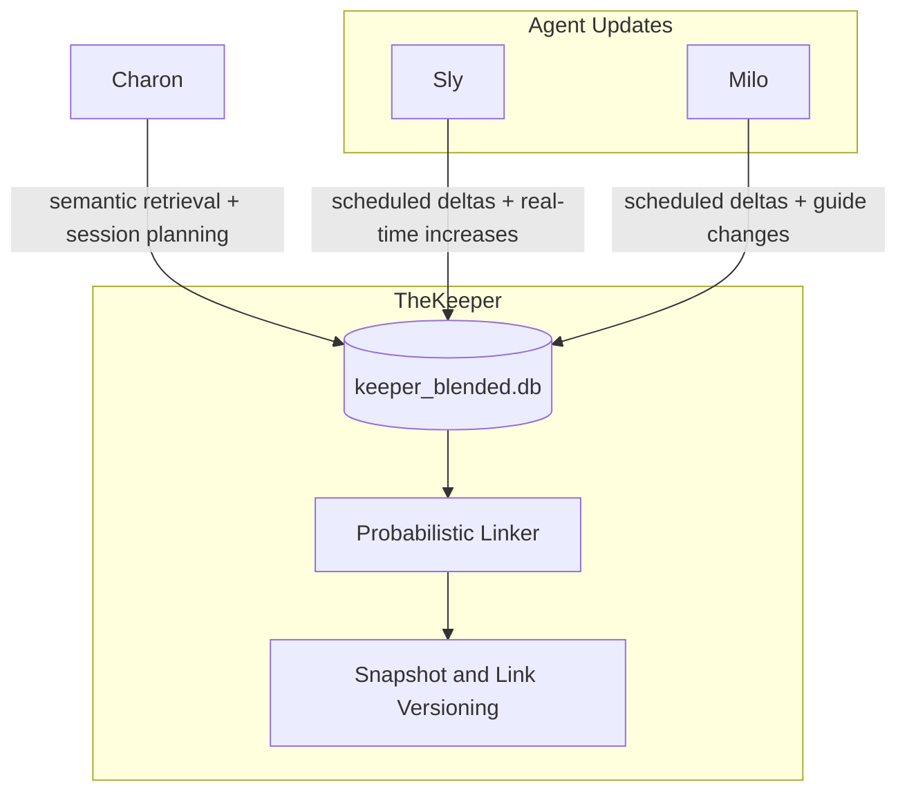

# 🗝️ TheKeeper: Semantic World-State Aggregator

TheKeeper is Charon's read-optimized world-state memory. It stores replicated gameplay and guide context so Charon can answer planning questions with local retrieval before calling the LLM.

## Core Responsibilities

- Receive replicated deltas from Sly and Milo without polling them every few minutes.
- Maintain a blended local view in SQLite (`keeper_blended.db`) for interaction and planning.
- Link game state and guide chunks using platform-aware probabilistic matching.
- Keep three retained versions for snapshots and links: latest, previous, and last stable.
- Surface discrepancy candidates for user-confirmed resolution flows in Charon.

## Trust Boundary

- TheKeeper is only a Charon-facing memory layer.
- TheKeeper does not expose or reason about backend execution authority.
- Charon should treat TheKeeper as the deepest data surface in interactive mode.

## Data Flow Model

1. Sly and Milo run on schedules to respect upstream rate limits.
2. On real-time increases (new game or guide delta), Sly and Milo push deltas.
3. TheKeeper ingests deltas, updates linked views, and versions snapshots.
4. Charon retrieves top context from TheKeeper for planning responses.
5. Charon proposes user-confirmed changes upward to governance paths.
6. Later syncs can surface discrepancies (trophy count, completion, platform version) for user confirmation.

## Linking Rules

- Join key baseline: game title plus platform.
- Link strategy: probabilistic matching with confidence scoring.
- Guide ranking preference: quality score driven by age and view count.
- Deterministic-only linking is intentionally avoided to reduce cross-platform mismatches.

## Internal Architecture



## Quickstart (For New Downloaders)

From the TheKeeper folder:

```bash
python scripts/bootstrap_keeper.py --seed-demo
```

What this does:

1. Initializes keeper tables if they do not exist.
2. Seeds demo chunks (only when empty).
3. Runs a retrieval smoke test and prints top matches.

### Optional Query Example

```bash
python scripts/bootstrap_keeper.py --seed-demo --query "best platinum cleanup route" --top-k 3
```

### Run Probabilistic Linker

```bash
python scripts/run_linker.py --db-path keeper_blended.db --threshold 0.55
```

This evaluates game-title + platform matches and persists confidence-scored links into `keeper_game_guide_links`.

### Run Discrepancy Workflow

Scan for mismatches between replicated game state and latest game snapshots:

```bash
python scripts/discrepancy_workflow.py --db-path keeper_blended.db --action scan
```

Resolve a pending discrepancy with user decision:

```bash
python scripts/discrepancy_workflow.py --db-path keeper_blended.db --action resolve --id 1 --decision CONFIRMED
```

List discrepancies by status:

```bash
python scripts/discrepancy_workflow.py --db-path keeper_blended.db --action list --status PENDING_USER
```

## Keeper Schema (Current)

- `keeper_chunks`: source text and metadata.
- `keeper_chunk_embeddings`: vector payloads keyed by `correlation_id` and `chunk_index`.
- `keeper_games`: replicated game-level state keyed by game title and platform.
- `keeper_guides`: replicated guide metadata with quality metrics.
- `keeper_game_guide_links`: probabilistic links with confidence and score features.
- `keeper_snapshots`: retained versions (`LATEST`, `PREVIOUS`, `STABLE`).
- `keeper_discrepancies`: surfaced delta mismatches pending user confirmation.

These tables are designed to support replicated deltas from Sly/Milo and interaction retrieval in Charon.

## Integration In Parent Workspace

Use these defaults in sibling repos:

- Milo `KEEPER_DB_PATH=../TheKeeper/keeper_blended.db`
- Charon `KEEPER_DB_PATH=../TheKeeper/keeper_blended.db`

Milo writes chunks and embeddings to keeper tables; Charon queries keeper tables first and falls back to Milo-local tables when needed.

### Recent Improvement Notes

- Keeper guide and chunk records are now used with trust metadata (`trust_status`, `trust_confidence`, source/sanitizer metadata) in the active retrieval path.
- Charon retrieval integration is now aligned to approved-only keeper chunks when trust columns are present.
- Probabilistic linking and discrepancy workflows remain the canonical operational path for blended guide/game context.

## Changelog

### v0.2.0 - 2026-07-14

Added:

- Trust-metadata integration expectations for Milo exports and Charon retrieval behavior.

Changed:

- Consolidated guidance for probabilistic linking plus discrepancy workflow as the primary blended-state operations model.
